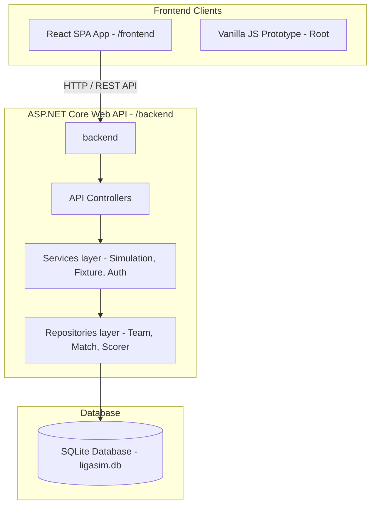

# 🏆 LigaSim Pro — Football League Simulator

Welcome to **LigaSim Pro**, a highly dynamic, premium full-stack football (soccer) league management and simulation platform. The system simulates a professional football league (like LaLiga) using a sophisticated weight-based engine (considering team power, stadium advantage, and randomized event-ticks) with real-time standings and top scorer (Pichichi) tracking.

The project features a **C# ASP.NET Core Web API** backend with a relational SQLite database, a highly responsive **React + Vite + Tailwind CSS** admin client, and a legacy **Vanilla JavaScript/HTML5** interactive prototype.

---

## 📸 Interface Preview

> [!NOTE]
> The admin console allows real-time week-by-week simulations, active team roster edits, and tracks a dynamic audio-enabled tournament progression.

```
┌────────────────────────────────────────────────────────┐
│  🏆 LEAGUE SIM  | Hafta 18 / 34      [Yönetici Modu] 🟢  │
├────────────────────────────────────────────────────────┤
│  [Son Maçlar]                   [Yaklaşan Fikstürler]   │
│  ⚽ RM 3 - 1 BAR                 ⚔️ ATM vs SEV           │
│  ⚽ ATM 2 - 0 GIR                ⚔️ GIR vs VIL           │
├────────────────────────────────────────────────────────┤
│  [Puan Tablosu]                                        │
│  1. Real Madrid       18  15  2  1  48-12  +36  47p    │
│  2. Barcelona         18  14  1  3  42-18  +24  43p    │
│  3. Atletico Madrid   18  12  3  3  35-15  +20  39p    │
└────────────────────────────────────────────────────────┘
```

---

## 🧱 Project Architecture

The workspace is organized into separate client-server architectures to promote separation of concerns and local testability:



### 1. 🖥️ Frontend (React & Vite) — `frontend/`
A premium Single Page Application built on **React 19**, **Vite**, and styled with custom **Tailwind CSS**. 
- **Dynamic Dashboard**: Full view of recently played games, upcoming schedules, Pichichi leaderboards, and league standings.
- **Interactive Audio Engine**: Procedural synthesizers that generate click feedbacks and highlight alerts dynamically without requiring heavy mp3 assets.
- **Admin Panel**: Secure password-protected state transition to unlock Team CRUD actions (create, edit, delete) and reset seasons.
- **Responsive Layout**: Designed for seamless use on ultra-wide desktop monitors down to mobile viewports.

### 2. 🔌 Backend (Web API) — `backend/`
An enterprise-ready **ASP.NET Core 8.0 Web API** written in C#, designed around clean architecture principles.
- **RESTful Endpoints**: Dedicated routes for `/api/teams`, `/api/fixtures`, `/api/simulation`, `/api/standings`, and `/api/auth`.
- **Entity Framework Core**: Interacts with a local SQLite file database (`ligasim.db`).
- **Berger Tables Fixture Generator**: Built-in tournament round-robin scheduler that creates balanced home-and-away matchups for any number of custom teams.
- **Sim Engine**: A modular simulator that calculates score odds utilizing a Gaussian-like distribution scaled by a team's custom `power` value.

### 3. 📄 Legacy Client (Vanilla HTML5) — Root directory
A lightweight, self-contained single-page client (`index.html`, `app.js`, `styles.css`) utilizing local state management for quick prototyping.

---

## 🚀 Getting Started

### 📋 Prerequisites
- **.NET SDK 8.0** or later
- **Node.js** (v18.x or later) & **npm** (v9.x or later)

---

### 🟢 1. Running the Backend API
Navigate to the API folder and launch the developer host:

```bash
cd backend
dotnet restore
dotnet run
```

The server will initialize on standard port:
- Local Web Server: `http://localhost:5000`
- Swagger OpenAPI Docs: `http://localhost:5000/swagger`

> [!TIP]
> The backend features **auto-migration and auto-seeding**. On the first execution, it automatically creates `ligasim.db`, registers the default Spanish LaLiga teams, and schedules a complete 34-week double round-robin league.

---

### 🔵 2. Running the React Frontend
Open a new terminal tab, navigate to the React app folder, and start the Vite local dev server:

```bash
cd frontend
npm install
npm run dev
```

- Local Client Address: `http://localhost:5173`

---

### ⚪ 3. Running the Legacy Client
If you'd like to test the isolated, database-free Vanilla JavaScript prototype:
1. Double-click the root `index.html` file in your system, or
2. Host it using a quick local server:
   ```bash
   npx serve .
   ```

---

## 🛠️ Features Breakdown

### 🎲 Weight-Scaled Simulation Engine
The core simulation uses a proprietary formula to compute realistic football score lines:
$$\text{Home Score} = \text{Poisson}(\lambda_{\text{home}}) \quad \text{where} \quad \lambda_{\text{home}} = f(\text{Power}_{\text{home}} + \text{Home Advantage})$$
$$\text{Away Score} = \text{Poisson}(\lambda_{\text{away}}) \quad \text{where} \quad \lambda_{\text{away}} = f(\text{Power}_{\text{away}})$$
This produces highly unpredictable results, but ensures elite teams consistently rank higher over a 34-match sample.

### ✍️ Pichichi Trophy Tracker
Every single simulated goal records a scorer entry. The simulator generates natural goalscorer names using real Spanish LaLiga player charts dynamically to populate the Golden Boot standings.

### 🔐 Administrative Authority
To modify the league, click on the **Yönetici Girişi** (Admin Login) button on the bottom left:
- **Default Username**: `admin`
- **Default Password**: `admin123`

Once logged in, you can add new clubs, edit stadium capacities, change team power levels, and delete existing clubs (which resets and regenerates the fixtures automatically).

---

## 📡 REST API Specifications

| Method | Endpoint | Description | Auth Required |
| :--- | :--- | :--- | :--- |
| **GET** | `/api/teams` | List all league clubs | No |
| **POST** | `/api/teams` | Create a new team | **Yes** |
| **PUT** | `/api/teams/{id}` | Edit club details (power, stadium, manager) | **Yes** |
| **DELETE** | `/api/teams/{id}` | Remove a club (forces fixture rebuild) | **Yes** |
| **GET** | `/api/fixtures` | Get all matches grouped by game-weeks | No |
| **POST** | `/api/fixtures/reset` | Resets all scores and standings to Week 1 | **Yes** |
| **POST** | `/api/simulation/week/{number}` | Simulates all games in the specified week | No |
| **POST** | `/api/simulation/remaining` | Simulates all remaining unplayed weeks at once | No |
| **GET** | `/api/standings` | Returns sorted league table rows | No |
| **GET** | `/api/standings/scorers` | Gets top goalscorer names and stats | No |
| **POST** | `/api/auth/login` | System login returning credentials | No |

---

## 🛡️ License

Distributed under the MIT License. See `LICENSE` for more information.

---

*Made with ❤️ for Football Managers and Simulation Enthusiasts.*
