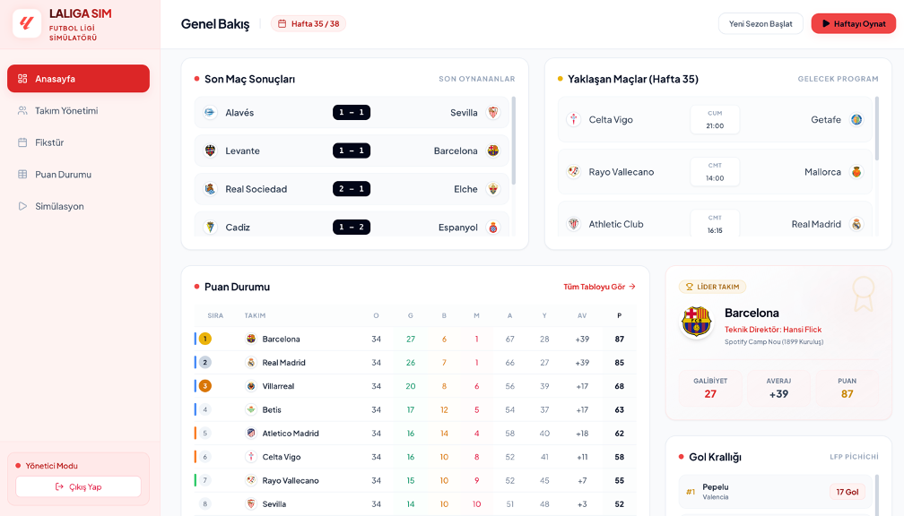
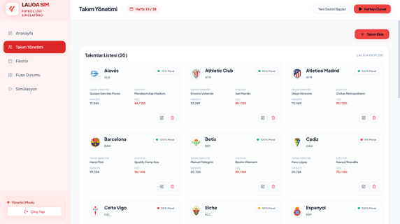
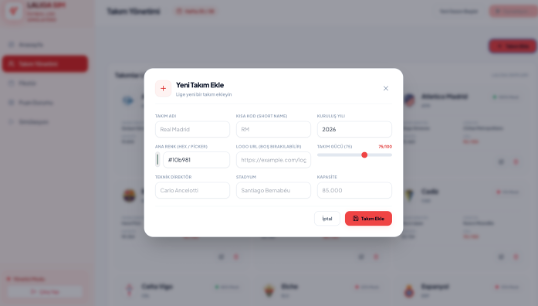
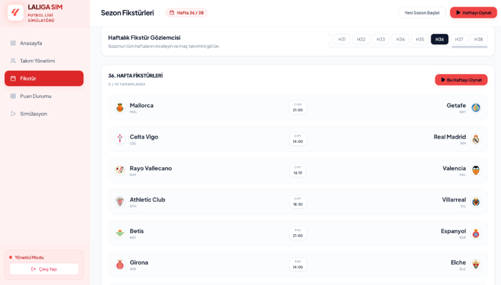
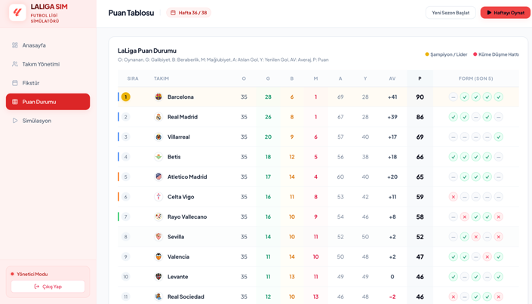

# LALIGA SIM — Football League Simulator

Welcome to **LALIGA SIM**, a highly dynamic, premium full-stack football league management and simulation platform. The system simulates a professional football league (like LaLiga) using a sophisticated weight-based engine (considering team power, stadium advantage, and randomized event-ticks) with real-time standings, weekly fixture schedules, custom team management, and top scorer (Pichichi) tracking. The project features a C# ASP.NET Core Web API backend with a relational SQLite database, a highly responsive React + Vite + Tailwind CSS admin client, and a legacy Vanilla JavaScript/HTML5 interactive prototype.

For details on the technical design, directory structure, REST API specifications, features, and how to run the applications locally, please refer to the [Architecture & System Documentation](architecture.md).

---

## System Screenshots

Here are screenshots showing the interactive user interface and features of **LALIGA SIM**:

### Genel Bakış (Dashboard)
The main dashboard displays the results of the recently played week, the fixtures for the upcoming matchday, the current top standings table, the leader team spotlight, and the current goalscorer leaderboard.

### Takım Yönetimi (Team Management)
An overview of all 20 teams currently registered in the league, showing their current manager, home stadium, stadium capacity, team power rating (out of 100), and team morale.

### Yeni Takım Ekle (Add Team)
The administrative modal dialog allowing managers to add new custom teams to the league. It supports customizing the team name, short code, founding year, primary color, logo URL, team power rating, manager name, stadium name, and capacity.

### Sezon Fikstürleri (Fixtures)
A complete week-by-week calendar of matches generated dynamically using the Berger round-robin scheduling algorithm, allowing managers to inspect and simulate games week-by-week.

### Puan Tablosu (Standings)
The live league table showing detailed statistics for each team (Played, Won, Drawn, Lost, Goals Scored, Goals Conceded, Goal Difference, and Points) along with their form guide for the last 5 matches.

